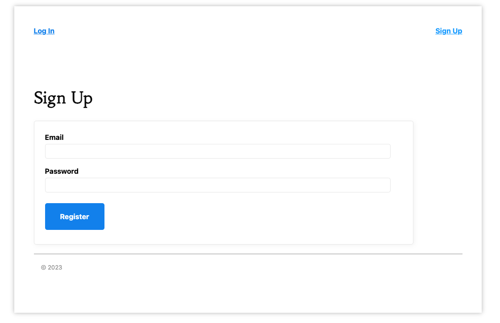
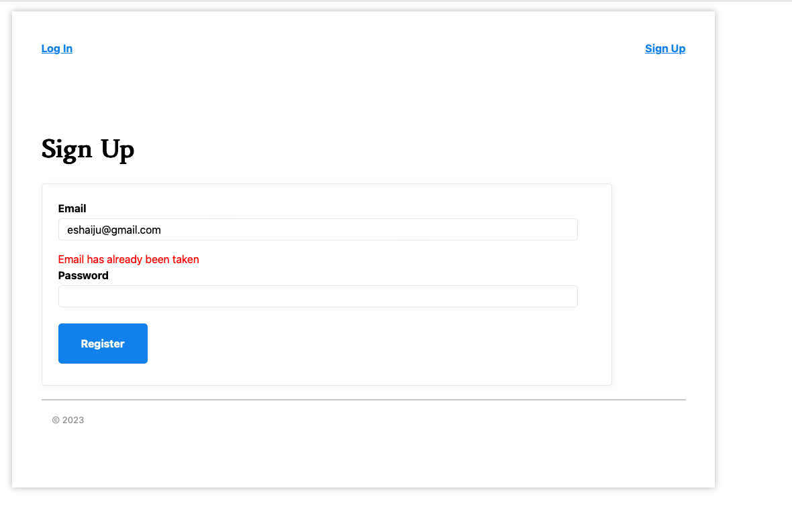
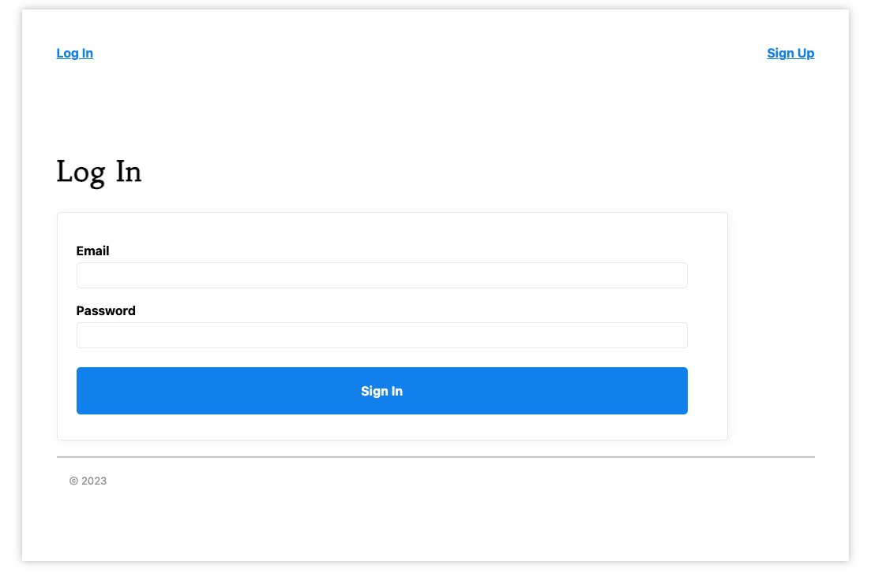
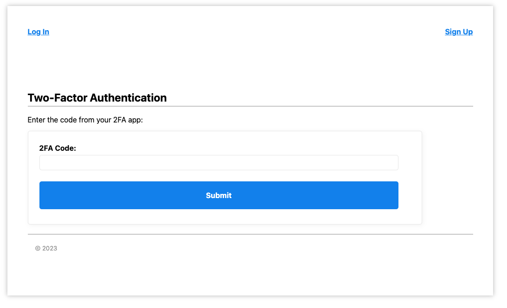
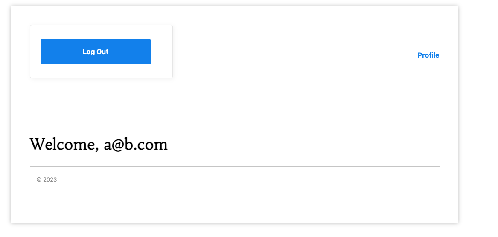
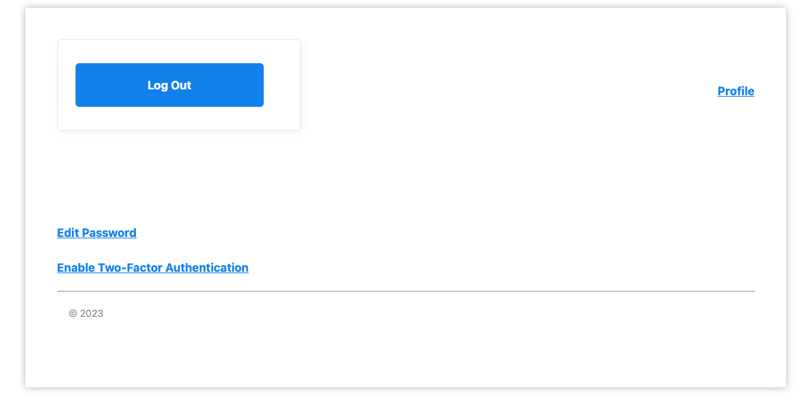
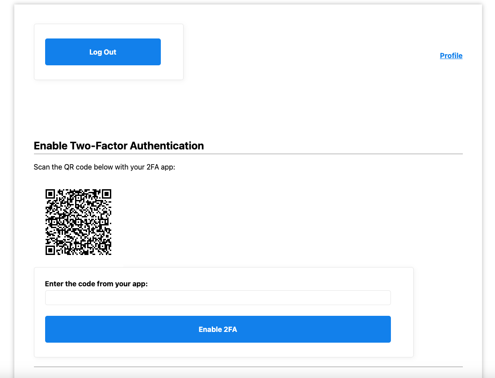
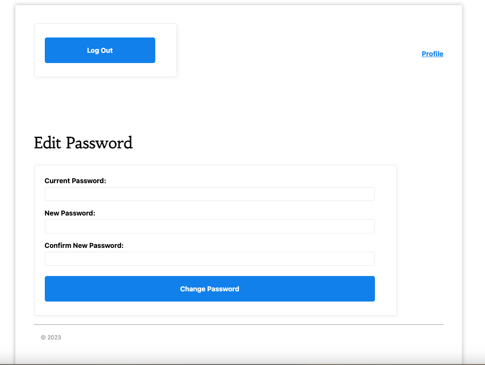
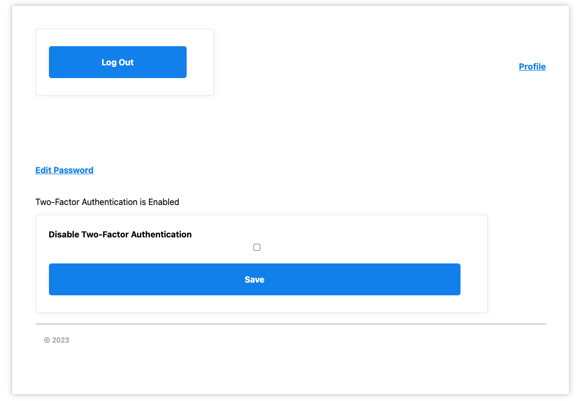

# Two-Factor Authentication Service

This implementation is a two-factor authentication service using Sinatra, providing an additional layer of security for user accounts. The service offers user registration, 2FA login, and account settings management.

## Features

### User Registration

- Users can create accounts by specifying their email and a secure password.
- A confirmation email is sent during registration to verify the user's email address.

### Two-Factor Authentication

- After registration, users can enable two-factor authentication (2FA) for their accounts.
- To set up 2FA, users need to scan a provided QR code into their preferred authenticator app (e.g., Google Authenticator).
- Users receive a secret key that allows them to recover their 2FA settings when needed.

### Login with 2FA

- When logging in, users initially enter their email and password as usual.
- After successful email and password verification, users are prompted to enter a 2FA code from their authenticator app.
- Access is granted only with a valid 2FA code.

### Account Settings Management

- Users can choose to disable 2FA.
- They have the option to reset their 2FA settings and generate a new secret key.
- Password changes are supported.
- Users can review and update their account details.

## Security Measures

- User passwords are securely hashed and stored in the database to protect their data.
- 2FA codes are generated and verified using industry-standard methods.
- User data and settings are safeguarded, and users can recover their 2FA settings using their secret key.

## Implementation

The service is built with the Sinatra web framework and uses a relational database (e.g., PostgreSQL) to securely store user information. The implementation adheres to established industry standards for password hashing and 2FA.


### Installing

1. Clone the repository:

   ```sh
   git clone git@github.com:eshaiju/two-factor-auth-app.git
   ```

2. Install gems using Bundler:

   ```sh
   bundle install
   ```

3. Prepare the database for local testing:

   ```sh
   rake db:create
   rake db:migrate
   ```

4. Run the application locally:

   ```sh
   foreman start
   ```

5. Set up and run MailCatcher locally to capture emails:

   ```sh
   gem install mailcatcher
   mailcatcher
   ```

   Visit [http://127.0.0.1:1080/](http://127.0.0.1:1080/) to view captured emails.

6. Access the application in your browser using [http://127.0.0.1:9393/](http://127.0.0.1:9393/).

7. Run the RSpec tests:

    ```sh
    bundle exec rspec


### Screenshots













